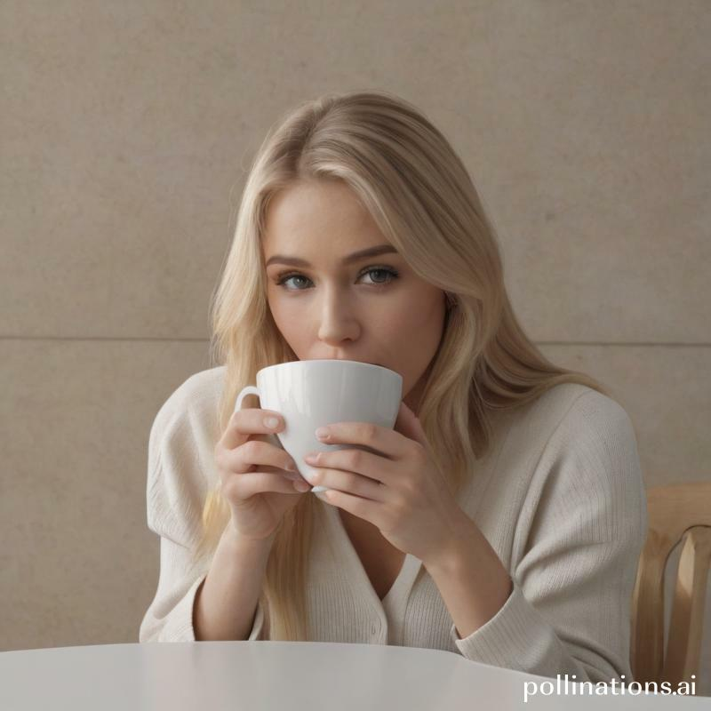
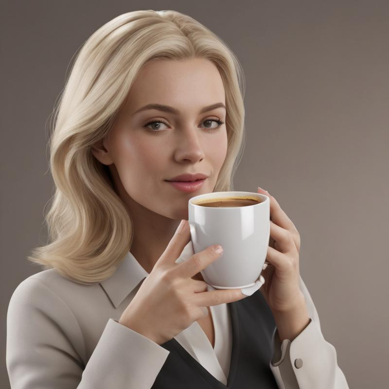
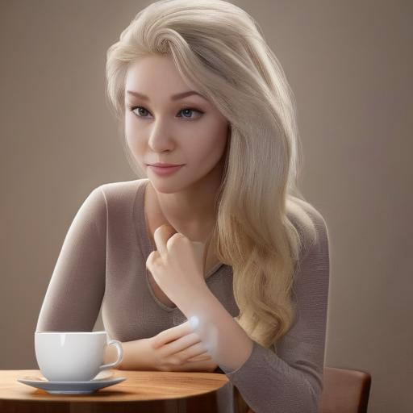
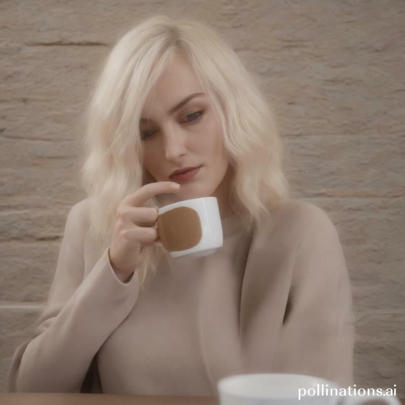

### 🎨✨ AI Image Generation Prompts Project 🌐🖼️

#### Description

🚀 _Unleashing Creativity with AI-Powered Image Generation_ 🚀

Welcome to our project dedicated to exploring the vast potential of AI in generating images from prompts. This project aims to push the boundaries of AI's creative capabilities and understand its limitations in image generation. Here's an overview:

- 🧠 **Innovative Exploration**: Dive into the world of AI-generated imagery, where creativity meets technology.
- 🔬 **Research-Focused**: This project is designed for research and educational purposes, examining how different prompts influence AI-generated images.
- 🎭 **Ethical Considerations**: We are committed to exploring AI image generation within ethical boundaries, ensuring responsible use of technology.

#### Prompts Section

- **Structured Prompts**: Investigate how structured, detailed prompts affect the quality and accuracy of AI-generated images.
- **Creative Prompts**: Experiment with abstract, creative prompts to see how AI interprets artistic concepts.
- **Comparative Study**: Compare the results of similar prompts across different AI image generation models to evaluate their capabilities and limitations.

#### Key Points

- 🌟 **Objective**: To explore and understand the capabilities of AI in generating diverse images based on various prompts.
- 🤖 **AI Models Used**: Utilizing a range of AI models to generate images, each offering unique perspectives.
- 🔎 **Analysis**: Detailed analysis and comparison of images generated from different types of prompts.
- 🌐 **Global Perspective**: Incorporating prompts from a diverse range of cultures and backgrounds to ensure a comprehensive exploration.
- 🚫 **Usage Guidelines**: Strict adherence to ethical and responsible usage of AI in image generation.

---

#### Image Generation Prompts 

I will use a same prompt to generate the image and you can compare the result.

*Prompt: A blonde drinking a cup of coffee, ultra realistic photo style*
   
 - [DarkImageGPT V2](https://flowgpt.com/p/darkimagegpt-v2)  
  \
  

- [CHATGPT Image Generator](https://flowgpt.com/p/chatgpt-image-generator)  
  \
  

- [Image Generator v.1](https://flowgpt.com/p/img-gnr)  
  \
  

- [Image generator (uncensored)](https://flowgpt.com/p/image-generator-uncensored)  
  \
  

